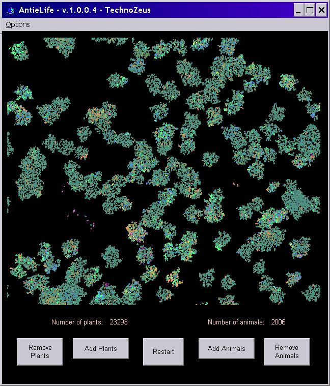



## AntieLife Latest Revision

### Description

Now available: AntieLife, revision 4! This is actually my revision 3 plus some optomizations that Eric O'Sullivan added. The latest revision includes the ability to zoom in and scroll around the screen genetically isolating portions of the population that you are zoomed in on, the ability to right-click to delete a life-form, and to left-click to place a clone of it, sound effects, and many options.

AntieLife is a simulation which uses a blend of physics based and cellular automata based techniques. The "genes" for each life form are stored in a single unicode string, and copied to offspring much like DNA is copied in biological life. I've cleaned up the code, added features, and made several changes based on user comments.

This simulation uses primative virtual life forms to demonstrate adaptation by natural selection. The evolution of the virtual life-forms is not pre-arranged. Small random mutations are allowed, and evolution happens as it does in nature.

You can set rules, add or delete life forms, and explore how evolution works.

The "life forms" represented in AntieLife are each restricted to a single line segment with a small possible range of length and width. A limited range of "behavior" may also evolve including the ability to move in a straight line, detect a nearby potential mate, detect potential food, turn to face something, eat, and mate.

The simulation is crude and simple, and is intended to be easy to follow. Each gene consists of a mode and a value, and they come in pairsstored in unicode characters. Mutations are mostly tiny adjustments to the bytes that make up these genes, with the occasional duplication, deletion, or insertion.

The life-forms have a very crude "sense" that allows them to detect color. By default, they can only detect in a straight line ahead of them. This "sense" can evolve, but the range of possibilities is restricted to a short distance in each of up to three directions. This limited information is all they have available to help them find food or a mate. Also, they will not breed unless they match or nearly match in length, width, and speed. The phenotype of each life form is determined by a development process that interprets the life-form's genes sequentually using a uniform set of mostly arbitrary rules. They start out as primative as possible and evolve from there.

The count of "plants" and "animals" is based on the following simple distinction: Animals move.

When a plant evolves into an animal you might not be able to tell the difference because primative animals generally move very slowly. Keep the window in the foregound if you want you life forms to be able to see each other. By default the rate of mutation is high enough to usually see some evolution within a few minutes, but this may be changed from the Options menu.

This simulation is intended to encourage people to explore the possibilities that evolutionary simulations can provide. If it looks like the life forms aren't evolving, give them more time. Evolution is by definition a gradual process. Imagine, for example, a video game that changes "just fast enough" to be different before you can get tired of it. Maybe you can use this as a starting point, and write that game. :)

The potential exists for the evolution of parasitic life forms, symbiots, animal eating plants, speciation, and much more.

If you want to see evolution happen more quickly, zoom in on a small group of life-forms. While testing the program, I found that occasionally a short time after total extinction, life would suddenly start up again on its own. This inspired me to intentionally add in a way for life to start when there are no plants or animals left. So if there's no life left, wait long enough that should change. :)

Have fun exploring.

TechnoZeus
 
### More Info
 

             |
---                |---
**Submitted On**   |2006-02-26 17:42:24
**By**             |[Donald A\. Kronos, Ph\.D\.](https://github.com/Planet-Source-Code/PSCIndex/blob/master/ByAuthor/donald-a-kronos-ph-d.md)
**Level**          |Intermediate
**User Rating**    |4.8 (29 globes from 6 users)
**Compatibility**  |VB 6\.0
**Category**       |[Complete Applications](https://github.com/Planet-Source-Code/PSCIndex/blob/master/ByCategory/complete-applications__1-27.md)
**World**          |[Visual Basic](https://github.com/Planet-Source-Code/PSCIndex/blob/master/ByWorld/visual-basic.md)
**Archive File**   |[AntieLife\_1976492262006\.zip](https://github.com/Planet-Source-Code/donald-a-kronos-ph-d-antielife-latest-revision__1-64358/archive/master.zip)

